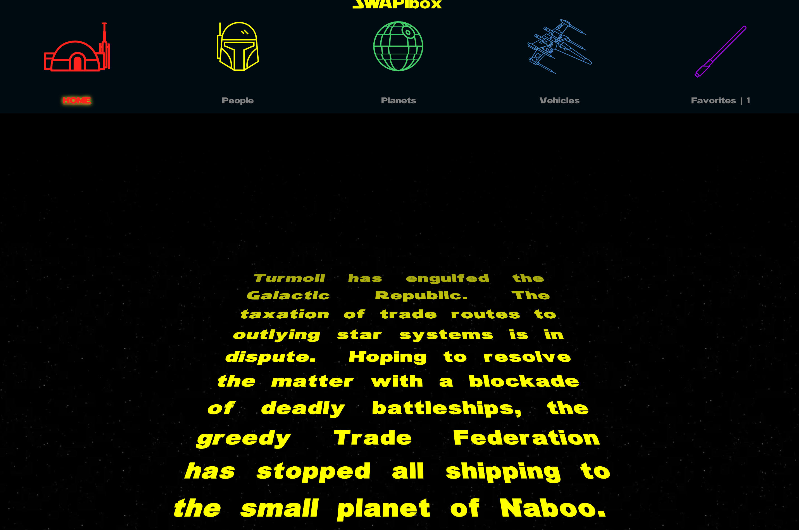
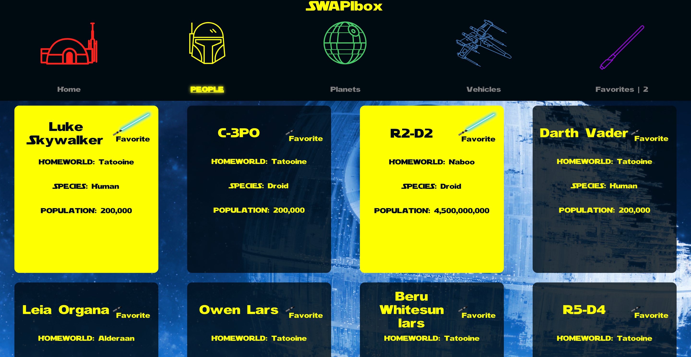
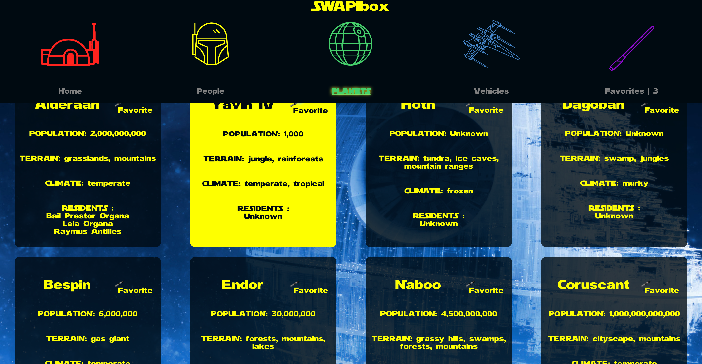
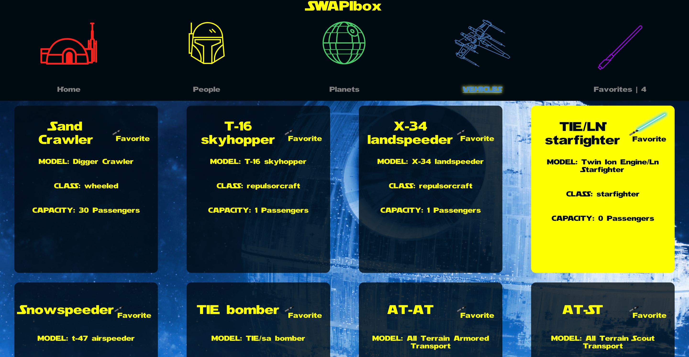
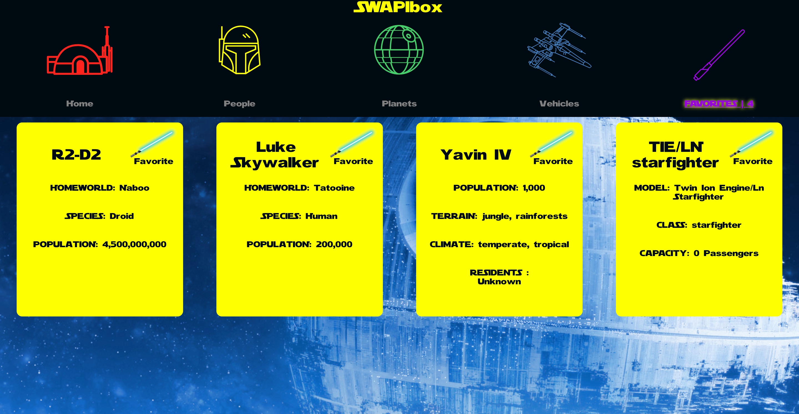

# SWAPIbox (Star Wars API box)

## Authors
* Eric O'Neill ([eoneill23](https://github.com/eoneill23))
* David Gitlen ([Davidagitlen](https://github.com/davidagitlen))

## Overview
SWAPIbox is a one-week paired project for front-end engineering students at the Turing School of Software and design.

The goal of the project is to fetch (sometimes nested) data -- a film, people, planets, and vehicles -- from the Star Wars API and display it using class and functional React components. 

The project also serves as an introduction to React Router to make it dynamic as well as propTypes to ensure each component is receiving the correct type of props.

## Getting started
* Clone down the repo and install the dependencies with `npm install`.
* Run `npm start` and visit http://localhost:3000 to view the application in the browser.
* Run the test suite with `npm test`.

## Learning goals
* Make informed design decisions to create a user-friendly application.
* Keep state based components to a minimum and leverage more functional components.
* Use a modular architecture for the application file structure.
* Become familiar with promises, nested fetch requests, and handling the UI based on acceptance of data.
* Use propTypes for every component receiving props.
* Write tests for React components, asynchronous functionality, and route handling.

## Built with
* `create-react-app`
* React Router
* Functional React components
* Class React components
* CSS
* Fetch API
* Star Wars API
* Testing with Enzyme and Jest

## Images

